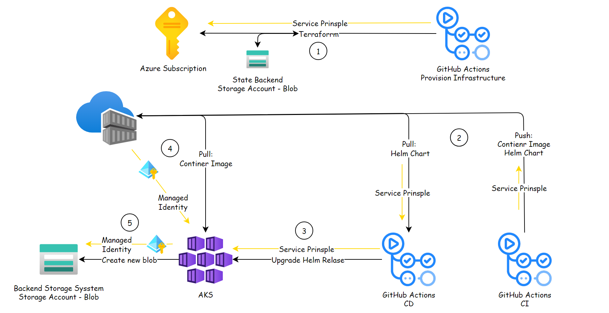

# Varonis Home Assignment - DevOps

## Assignment Overview


Varonis Home Assignment - DevOps

Develop a simple system that manages a list of restaurants and their properties. e.g., address, style (Italian, French, Korean), vegetarian (yes/no), opening hours, deliveries, etc.

The system will have an API for querying with a subset of these parameters and return a recommendation for a restaurant that answers the criteria, including the time of the request to check if it is open.

e.g., “A vegetarian Italian restaurant that is open now”  should return a JSON object with the restaurant and all its properties:
```json
{
    "restaurantRecommendation": {
    "name": "Pizza Hut",
    "style": "Italian",
    "address": "Wherever Street 99, Somewhere",
    "openHour": "09:00",
    "closeHour": "23:00",
    "vegetarian": "Yes"
    }
}
```


* The assignment submission should be in a GIT repo that we can access; it could be yours or a dedicated one.Please include all code required to set up the system.

* The system has to be cloud-native, with a preference for Azure and a simple architecture that will require minimal maintenance.

* The system should be written in full IaC style. I should be able to fully deploy it on my own cloud instance without making manual changes. Use Terraform for configuring the required cloud resources.

* Some backend storage mechanisms should hold the history of all requests and returned responses.

* Consider that the backend data stored is highly confidential.
Make sure the system is secure.
However, there is no need for the user to authenticate with the system (Assume it’s a free public service)

* The system code should be deployed using an automatic CI\CD pipeline following any code change, including adding or updating restaurants.
The code should be ready for code review (as possible)

* Coding: Python \ PowerShell 
IaC: Terraform


---
<br/>
<br/>
<br/>

# Solution 

### Architecture

**Authentication**



**Description** 
* Authentication via GitHub Actions to Azure resources - Implemented via a service principal. The secret for authenticating with Azure is embedded into GitHub secrets. This step is required as a one-time onboarding step and for rotating the secret in the future.
* Azure resources communication - AKS and ACR resources support Microsoft Entra authentication. Therefore, we can utilize Managed Identity to eliminate the need for developers to manage credentials manually.


---


<br/>
<br/>
<br/>
<br/>
<br/>
<br/>
<br/>
<br/>
<br/>


**Terraform Architecture**
GitHub Actions workflows to manage Azure infrastructure with Terraform.


1. Create a new branch and check in the needed Terraform code modifications.
2. Create a Pull Request (PR) in GitHub once you're ready to merge your changes into your environment.
3. A GitHub Actions workflow will trigger to ensure your code is well formatted, internally consistent, and produces secure infrastructure. In addition, a Terraform plan will run to generate a preview of the changes that will happen in your Azure environment.
4. Once appropriately reviewed, the PR can be merged into your main branch.
5. Another GitHub Actions workflow will trigger from the main branch and execute the changes using Terraform.

**Onbording**

1. Create `Service Principal` for Githu action create resources on teh target subscription.
2. Terrafrom backend state - Create Azure blob storage as remote backend
    * Update `backend` block.
3. Ingest `secrets` into Github

---


**Steps**

1. Provision Azure resource : `Service Principal` [**Day 0**]
    * Create ENV var named TAREGT_SUBSCRIPTION with the target subscsription ID as value and save inisde a file name `.env`  under `Provision-Infrastructure` dir .
    * Run the script for creation `Service Principal` at `Provision-Infrastructure/scripts/init-service-principal.sh`, the script will load the env `TAREGT_SUBSCRIPTION` from teh `.env` file
    *  Extract the env from the az coomnd output 
```bash
./init-service-principal.sh
...

# The az command below will create an app registration and service principal
az ad sp create-for-rbac -n ProvisionInfrastructure --role="Contributor" --scopes="/subscriptions/$TAREGT_SUBSCRIPTION"

The output includes credentials that you must protect. Be sure that you do not include these credentials in your code or check the credentials into your source control. For more information, see https://aka.ms/azadsp-cli
{
  "appId": "***", # client_id
  "displayName": "ProvisionInfrastructure",
  "password": "***", # client_secret
  "tenant": "***" # tenant_id
}


These values map to the Terraform variables like so:

appId is the client_id defined above.
password is the client_secret defined above.
tenant is the tenant_id defined above.
```

Append the env varibels the .env file :

```bash
export TAREGT_SUBSCRIPTION='' # Subscription ID
export CLIENT_ID=""
export CLIENT_SECRET=""
export TENANT_ID=""
```

Test the `Service Principal` , using the script located at : `Provision-Infrastructure/scripts/test-service-principal.sh`

```bash
source  .env
az login --service-principal -u $CLIENT_ID -p $CLIENT_SECRET --tenant $TENANT_ID

# Once logged in as the Service Principal - we should be able to list the VM sizes by specifying an Azure region, for example here we use the West US region:

az vm list-sizes --location westus
az account list-locations

az logout
```


2. Terrafrom backend state

In case the target subscription is a new one validate the providers below are registerd to alow resources creation :
```bash
az provider register --namespace Microsoft.Storage
az provider register --namespace Microsoft.Compute
az provider register --namespace Microsoft.Network
```


Run the script at : `Provision-Infrastructure/scripts/remote-state.sh` to create an Azure storage account and container:
```bash
#!/bin/bash

RANDOM_STRING=$(head /dev/urandom | tr -dc a-z0-9 | head -c 10)
RESOURCE_GROUP_NAME=tfstate
STORAGE_ACCOUNT_NAME=tfstate$RANDOM_STRING
CONTAINER_NAME=tfstate

az group create --name $RESOURCE_GROUP_NAME --location eastus
az storage account create --resource-group $RESOURCE_GROUP_NAME --name $STORAGE_ACCOUNT_NAME --sku Standard_LRS --encryption-services blob
az storage container create --name $CONTAINER_NAME --account-name $STORAGE_ACCOUNT_NAME
```


Update the Storage Account name to the backed block and commit you changes.
```terraform
  backend "azurerm" {
      resource_group_name  = "tfstate"
      storage_account_name = "<storage_account_name>"
      container_name       = "tfstate"
      key                  = "terraform.tfstate"
  }
```


Initialize `GitHu Action secrets`

```
export ARM_CLIENT_ID="00000000-0000-0000-0000-000000000000"
export ARM_CLIENT_SECRET="12345678-0000-0000-0000-000000000000"
export ARM_TENANT_ID="10000000-0000-0000-0000-000000000000"
export ARM_SUBSCRIPTION_ID="20000000-0000-0000-0000-000000000000"
```
You cam use above env to investigate remote state interaction for example to run `terrafom init`.


Update github secrets. 
Navigate to The repo `Actions` > `Secrets and variables` > `Actions` , then click on `New repository secret` to set up nthe `ARM_*` above as secret for Flows (CI-CD).


